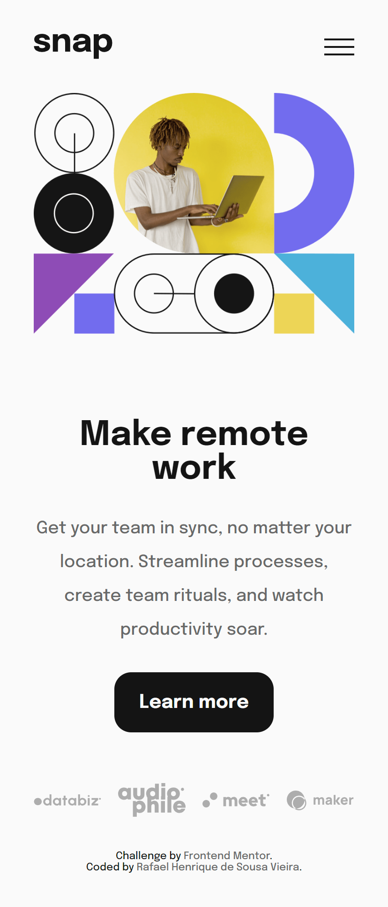

# Frontend Mentor - Intro section with dropdown navigation solution

> This is a solution to the [Intro section with dropdown navigation challenge on Frontend Mentor](https://www.frontendmentor.io/challenges/intro-section-with-dropdown-navigation-ryaPetHE5). Frontend Mentor challenges help you improve your coding skills by building realistic projects. 

## Table of contents

- [Overview](#overview)
  - [The challenge](#the-challenge)
  - [Links](#links)
  - [Screenshot](#screenshot)
- [My process](#my-process)
  - [Built with](#built-with)

## Overview

### The challenge

Users should be able to:

- View the relevant dropdown menus on desktop and mobile when interacting with the navigation links
- View the optimal layout for the content depending on their device's screen size
- See hover states for all interactive elements on the page

### Links

- Solution URL: URL SOLUTION HERE
- Live Site URL: https://intro-section-with-dropdown-navigati.netlify.app

### Screenshot

  - Desktop
  
    
    
  - Mobile
    
    

## My process

### Built with

- HTML
- CSS
- JAVASCRIPT

[⬆ Back to the top](#frontend-mentor---intro-section-with-dropdown-navigation-solution) 
